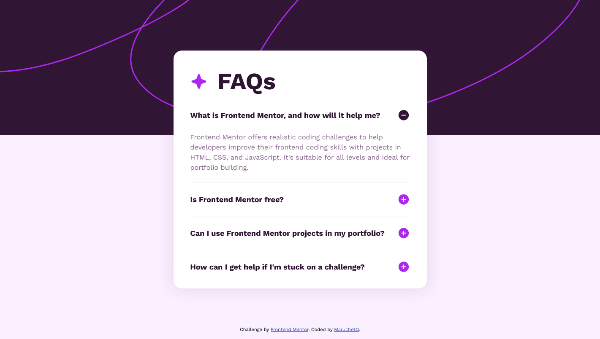

# Frontend Mentor - FAQ accordion solution

This is a solution to the [FAQ accordion challenge on Frontend Mentor](https://www.frontendmentor.io/challenges/faq-accordion-wyfFdeBwBz). Frontend Mentor challenges help you improve your coding skills by building realistic projects. 

## Table of contents

- [Overview](#overview)
  - [The challenge](#the-challenge)
  - [Screenshot](#screenshot)
  - [Links](#links)
- [My process](#my-process)
  - [Built with](#built-with)
  - [What I learned](#what-i-learned)
  - [Useful resources](#useful-resources)
- [Author](#author)
- [Acknowledgments](#acknowledgments)

## Overview

### The challenge

Users should be able to:

- Hide/Show the answer to a question when the question is clicked
- Navigate the questions and hide/show answers using keyboard navigation alone
- View the optimal layout for the interface depending on their device's screen size
- See hover and focus states for all interactive elements on the page

### Screenshot



### Links

- Solution URL: [Add solution URL here](https://your-solution-url.com)
- Live Site URL: [Add live site URL here](https://your-live-site-url.com)

## My process

### Built with

- Semantic HTML5 markup
- CSS custom properties
- Flexbox
- Mobile-first workflow

### What I learned

```js
// closest() - https://www.w3schools.com/jsref/met_element_closest.asp
    const btn = event.target.closest(".question-section").querySelector(".btn");
    const closestAnswer = event.target.closest(".qna").querySelector(".answer");
    if (btn.classList.contains("hidden")) {
      btn.classList.remove("hidden");
      btn.setAttribute("src", "./assets/images/icon-minus.svg");
      btn.classList.add("shown");
      closestAnswer.style.display = "block";
    } else if (btn.classList.contains("shown")) {
      btn.classList.remove("shown");
      btn.setAttribute("src", "./assets/images/icon-plus.svg");
      btn.classList.add("hidden");
      closestAnswer.style.display = "none";
```

If you want more help with writing markdown, we'd recommend checking out [The Markdown Guide](https://www.markdownguide.org/) to learn more.

### Useful resources

- [closest()](https://www.w3schools.com/jsref/met_element_closest.asp)

## Author

- Frontend Mentor - [@MaruchetO](https://www.frontendmentor.io/profile/MaruchetO)

## Acknowledgments

I found that there is the `closest()` method from the solution of [SortJakke](https://github.com/SortJakke/FM-faq_accordion/blob/391bea110818ee7d0e9ec4ab7a3e1d98ba0d1465/script.js#L54).
